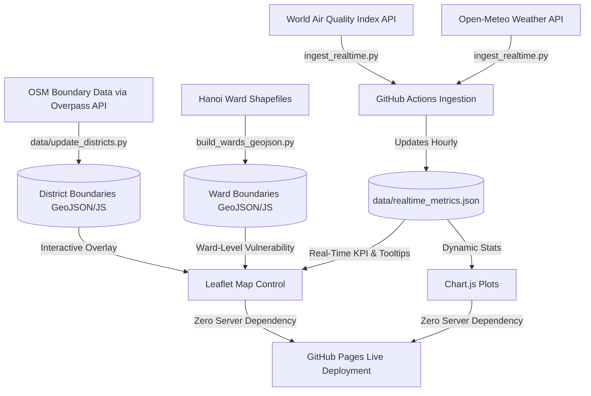

# 🍃 Hanoi Urban Ecosystem & Environmental Dashboard

[](https://tungducvu.github.io/Hanoi-Urban-Ecosystem-Dashboard/)
[](https://github.com/TungDucVu/Hanoi-Urban-Ecosystem-Dashboard)
[](https://github.com/TungDucVu/Hanoi-Urban-Ecosystem-Dashboard)
[](https://github.com/TungDucVu/Hanoi-Urban-Ecosystem-Dashboard)

An interactive, serverless spatial and statistical dashboard analyzing the relationships between **Environmental Quality** and **Urbanization Pressure** across all administrative districts and wards of Hanoi. 

The dashboard features direct GIS mapping, dynamic correlation statistics, and an automated data pipeline that fetches real-time air quality (AQI) and meteorological data hourly, recalculating thermal profiles and flood warnings on the fly.

🔗 **Live Demo:** [Hanoi Urban Ecosystem Dashboard](https://tungducvu.github.io/Hanoi-Urban-Ecosystem-Dashboard/)

---

## 🗺️ System Architecture & Data Flow

This project utilizes a hybrid architecture: geospatial data processing is done offline using Python and GeoPandas, while real-time environmental metrics are updated hourly via GitHub Actions and visualized client-side.



---

## 🌟 Key Interactive Features

The dashboard separates analysis into two primary thematic modules:

### 1. 🍃 Environmental Quality Module
* **Real-time & Climate AQI Map**: A choropleth map color-coding districts based on their Air Quality Index (AQI) severity (Good, Moderate, Unhealthy, Severe).
* **Thermal Profile (LST Proxy)**: Visualizes average Land Surface Temperature across districts, illustrating the Urban Heat Island (UHI) effect.
* **Solid Waste Footprint**: Tracks daily household solid waste collection volumes (tons/day).
* **Rankings Comparison**: Interactive Chart.js bar charts comparing municipal solid waste generation and thermal levels across Hanoi.

### 2. 🏙️ Urban Pressure Module
* **Population Density Metrics**: Visualizes census density maps, shifting from green (low density) to crimson (dense urban core).
* **Rain-Induced Flood Hotspots**: Simulates and tracks localized flooding risk during the rainy season.
* **Density-Flood Correlation**: Scatter plots correlating population density against recurrent flood hotspots, highlighting structural drainage vulnerability.
* **Composite Vulnerability Assessment**: Ward-level spatial vulnerability map index highlighting areas with cumulative environmental risks.

---

## 📊 Scientific Methodology

### 🛡️ Ward-Level Composite Vulnerability Score
Wards are evaluated on a weighted composite vulnerability index ($V_{score}$) from 1 to 100, calculated as follows:

$$V_{score} = 0.20 \cdot AQI_{norm} + 0.20 \cdot LST_{norm} + 0.20 \cdot Flood_{norm} + 0.15 \cdot Density_{norm} + 0.15 \cdot BuiltUp_{norm} + 0.10 \cdot (100 - Green_{space})$$

* **AQI / LST / Flood / Density**: Normalized relative metrics calculated from regional baselines.
* **BuiltUp**: Built-up area ratio representing impervious surface cover.
* **Green Space**: Inverted green space ratio (lower vegetation cover leads to higher vulnerability).

---

## 📁 Repository Structure

```text
Hanoi-Urban-Ecosystem-Dashboard/
├── .github/workflows/
│   └── hourly_ingest.yml    # GitHub Actions workflow running hourly cron jobs
├── data/
│   ├── hanoi_districts.geojson  # GeoJSON boundaries of Hanoi districts
│   ├── hanoi_districts.js       # JS-wrapped district coordinates (bypasses CORS)
│   ├── hanoi_wards.geojson      # Ward-level spatial boundaries
│   ├── hanoi_wards.js           # JS-wrapped ward coordinates
│   ├── realtime_metrics.json    # Hourly fetched real-time AQI and weather stats
│   └── hanoi_environmental_urban_metrics.csv # Static socioeconomic baseline data
├── build_wards_geojson.py   # Processes GIS shapefiles and compiles ward attributes
├── dissolve_districts.py    # Dissolves ward-level geometry into unified district boundaries
├── ingest_realtime.py       # Python script querying environmental APIs
└── index.html               # Frontend dashboard portal (HTML5 / Vanilla CSS / JS)
```

---

## 🚀 How to Run Locally

Since the dashboard compiles all styling, libraries, and GIS assets client-side, no database installation is required.

### Quick Start (Offline Mode)
Simply double-click the **`index.html`** file in your local file explorer to view the dashboard instantly in any web browser.

### Local Web Server (Recommended)
To prevent potential local file restriction issues (CORS) when loading geospatial scripts:
1. Open a terminal inside the project directory.
2. Initialize Python's built-in HTTP server:
   ```bash
   python -m http.server 8000
   ```
3. Navigate to the local URL in your web browser:
   ```text
   http://localhost:8000
   ```

---

## ⚙️ Setting Up Your Own Ingestion Pipeline

To run the automated hourly real-time ingestion pipeline, you can configure GitHub Actions using your own API tokens:

1. **Get a free WAQI API Token**: Sign up at [aqicn.org/api/](https://aqicn.org/api/).
2. **Add Secret to GitHub**:
   * Navigate to your GitHub Repository -> **Settings** -> **Secrets and variables** -> **Actions**.
   * Create a new repository secret named `WAQI_API_TOKEN` and paste your API key.
3. **Enable GitHub Pages**:
   * Go to **Settings** -> **Pages**.
   * Under **Build and deployment**, select **GitHub Actions** as the source.
4. The workflow (`hourly_ingest.yml`) will automatically run hourly, fetch weather/AQI, commit updates to `data/realtime_metrics.json`, and rebuild the live page.

---

## 📚 Data Sources
* **Administrative Boundaries**: OpenStreetMap (OSM) retrieved via Overpass API queries.
* **Real-time Air Quality**: World Air Quality Index (WAQI) Project.
* **Real-time Weather**: Meteorological data and soil temperatures from the Open-Meteo API.
* **Socioeconomic Indicators**: Compiled from official Hanoi municipal statistical reports.
* **Thermal Gradients**: Landsat-8 Thermal Infrared Sensor (TIRS) band imagery.
